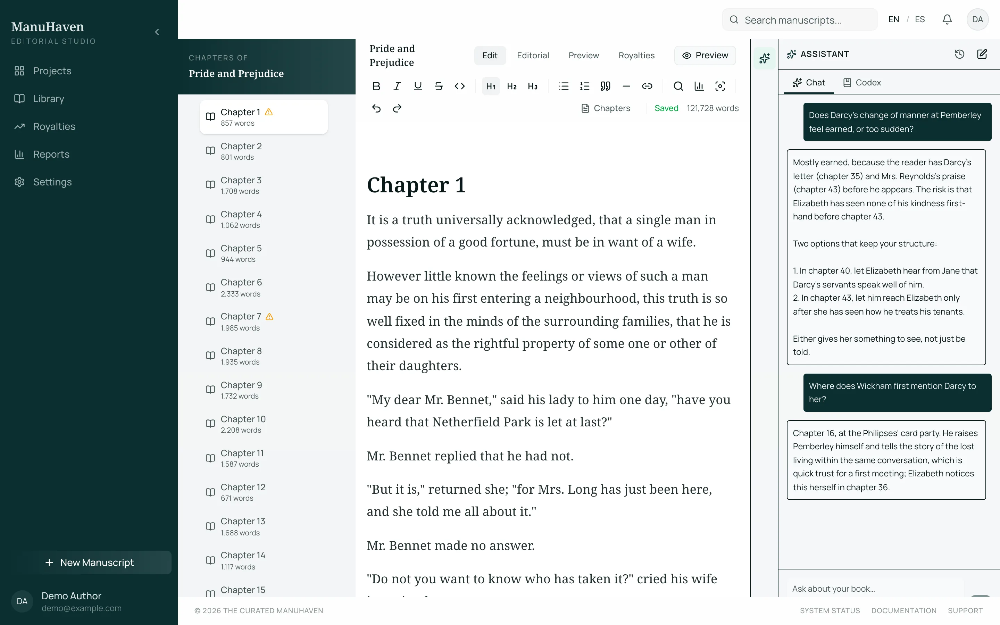
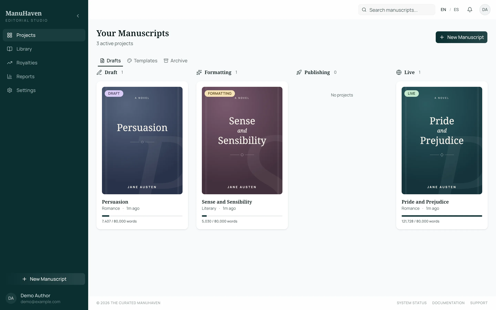
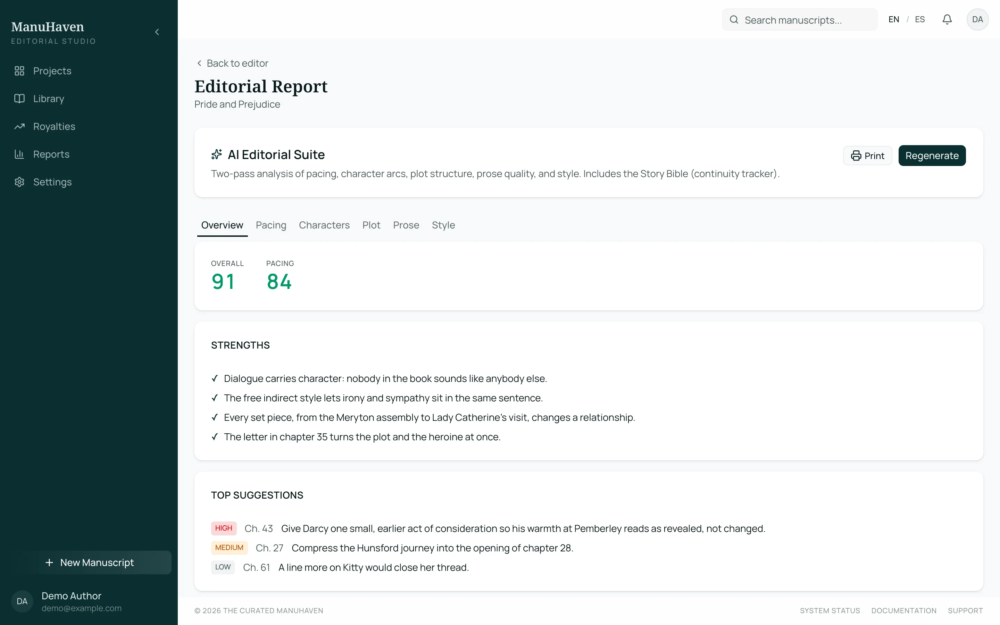
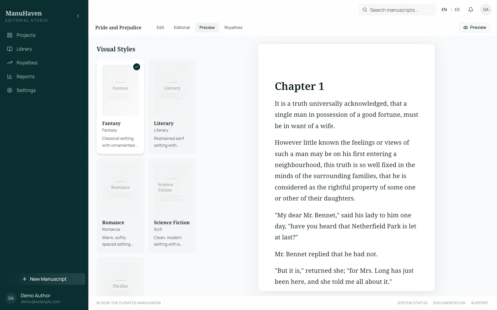
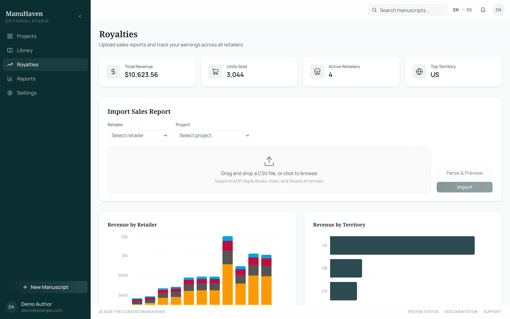
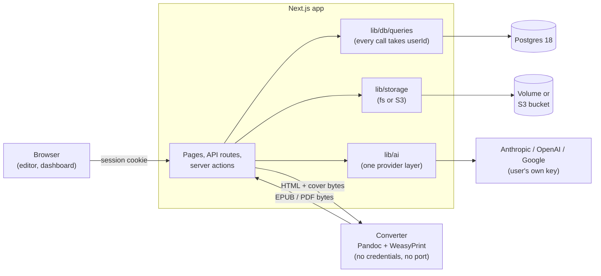

<p align="center">
  <picture>
    <source media="(prefers-color-scheme: dark)" srcset="docs/images/logo-dark.svg">
    
  </picture>
</p>

<h3 align="center">The open-source, self-hosted alternative to Scrivener + Vellum.</h3>

<p align="center">
  Write your novel in the browser, get AI editorial help that runs on <em>your</em> API key,<br>
  export retail-ready EPUB and PDF, and track your royalties. All on your own server.
</p>

<p align="center">
  <a href="https://github.com/julianavellaneda/manuhaven/actions/workflows/ci.yml"></a>
  <a href="https://github.com/julianavellaneda/manuhaven/releases"></a>
  <a href="LICENSE"></a>
  <a href="https://github.com/julianavellaneda/manuhaven/pkgs/container/manuhaven"></a>
</p>

<p align="center">
  <a href="#quick-start">Quick start</a> ·
  <a href="docs/self-hosting.md">Self-hosting</a> ·
  <a href="ROADMAP.md">Roadmap</a> ·
  <a href="CONTRIBUTING.md">Contributing</a> ·
  <a href="https://github.com/julianavellaneda/manuhaven/discussions">Discussions</a>
</p>

<p align="center">
  
</p>

> **Status: pre-1.0, and honest about it.** The studio works end to end;
> a hosted demo and a docs site are still to come. See [`ROADMAP.md`](ROADMAP.md).

## What it does

| | |
|---|---|
| **Write** | Tiptap editor with chapter navigation, drag-and-drop reordering, split/merge, find and replace, writing stats, distraction-free mode, autosave with version history. Imports `.docx` and `.txt`. |
| **Analyze** | Editorial report, style analysis, continuity checking, and a chat assistant grounded in your actual chapters. Runs on an API key you supply — Anthropic, OpenAI, or Google. |
| **Format & export** | Five genre CSS templates rendered to EPUB 3 and print-ready PDF by a Pandoc + WeasyPrint service. Output validates clean against epubcheck 5.1. |
| **Track** | Royalty CSV import for KDP, Apple, Kobo, and StreetLib, with per-title revenue charts. |
| **Bilingual** | Complete English and Mexican Spanish interface, including the editorial AI prompts. |

**AI is entirely optional and off by default.** With no key configured the AI
surfaces stay inert and everything else works normally.

<table>
  <tr>
    <td width="50%"><br><sub><b>Projects</b>: every book, from draft to live.</sub></td>
    <td width="50%"><br><sub><b>Editorial report</b>: pacing, characters, plot and prose, chapter by chapter.</sub></td>
  </tr>
  <tr>
    <td width="50%"><br><sub><b>Format</b>: pick a genre template, preview it, export EPUB and PDF.</sub></td>
    <td width="50%"><br><sub><b>Royalties</b>: import retailer CSVs and see what each title earned.</sub></td>
  </tr>
</table>

<sub>Screenshots show the demo account from <code>bun run db:seed</code>, with <em>Pride and Prejudice</em> from Project Gutenberg.</sub>

## How it compares

| | ManuHaven | Scrivener | Vellum | Calibre / Sigil | novelWriter / Manuskript | Atticus | Sudowrite |
|---|---|---|---|---|---|---|---|
| Open source | AGPL-3.0 | no | no | GPL | GPLv3 | no | no |
| Self-hostable | yes | desktop only | desktop only (macOS) | desktop only | desktop only | no | no |
| Write in a browser | yes | no | no | no | no | yes | yes |
| AI that reads your book | yes, your key | no | no | no | no | no | yes, their key |
| Generates prose for you | **no, by design** | no | no | no | no | no | yes |
| EPUB + print PDF export | yes | yes | yes | yes | limited | yes | no |
| Royalty tracking | yes | no | no | no | no | no | no |
| Bilingual interface | EN + es-MX | many languages | EN | varies | varies | EN | EN |
| Price | free | $59.99 once | from $199.99 once | free | free | $147 once | from $19/mo |

The honest summary: Scrivener is a deeper desktop drafting tool, Vellum makes
beautiful books on a Mac, Calibre and Sigil are better at converting and editing
existing ebooks, and novelWriter is a lovely desktop novel manager. Nothing in
that list does the whole loop — write, analyze, format, export, track — in one
place that you can run yourself.

## Quick start

You need Docker and `openssl`. No cloud account of any kind: the database,
auth, file storage and the export service all run in containers on your
machine.

```bash
git clone https://github.com/julianavellaneda/manuhaven.git
cd manuhaven
./scripts/setup.sh        # writes .env with generated secrets
docker compose up -d      # app on :3000; Postgres and the converter stay internal
```

Open <http://localhost:3000>, create an account, and upload a manuscript. The
app applies database migrations on start.
[`docs/self-hosting.md`](docs/self-hosting.md) covers sign-in options, S3
storage, reverse proxies, backups, and upgrades.

Want to hack on it instead? [`CONTRIBUTING.md`](CONTRIBUTING.md) has the
development setup, including `bun run db:seed` for a demo account full of
sample data.

## Architecture

| Layer | Technology |
|---|---|
| App | Next.js 16 App Router, React 19, Tailwind 4, shadcn on Base UI |
| Database | Postgres 18 via Drizzle ORM; every query scoped by user in `lib/db/queries/` |
| Auth | Better Auth — email/password, magic link, Google |
| Files | Local volume or any S3-compatible bucket, served only through an authz-checked route |
| Editor | Tiptap 3 |
| AI | Vercel AI SDK 6 — Anthropic, OpenAI, or Google, keyed per user |
| Export | Pandoc + WeasyPrint in a container (`services/converter`) |
| i18n | next-intl, `en` and `es-MX` at exact key parity |


```mermaid
flowchart LR
  browser["Browser<br/>(editor, dashboard)"]
  subgraph app["Next.js app"]
    routes["Pages, API routes,<br/>server actions"]
    queries["lib/db/queries<br/>(every call takes userId)"]
    storage["lib/storage<br/>(fs or S3)"]
    ai["lib/ai<br/>(one provider layer)"]
  end
  pg[("Postgres 18")]
  files[("Volume or<br/>S3 bucket")]
  conv["Converter<br/>Pandoc + WeasyPrint<br/>(no credentials, no port)"]
  llm["Anthropic / OpenAI / Google<br/>(user's own key)"]

  browser -- "session cookie" --> routes
  routes --> queries --> pg
  routes --> storage --> files
  routes -- "HTML + cover bytes" --> conv
  conv -- "EPUB / PDF bytes" --> routes
  routes --> ai --> llm
```

| Doc | |
|---|---|
| [`docs/self-hosting.md`](docs/self-hosting.md) | Running your own instance |
| [`docs/architecture.md`](docs/architecture.md) | How the pieces fit together |
| [`docs/ai.md`](docs/ai.md) | Providers, BYOK, budgets, privacy |
| [`docs/i18n.md`](docs/i18n.md) | Translations, and adding a locale |
| [`ROADMAP.md`](ROADMAP.md) | What is planned, and what never will be |

Every environment variable is in [`docs/self-hosting.md`](docs/self-hosting.md#2-configure).
`docs/platform/` holds the deeper reference material — schema, design system,
EPUB specification.

## Engineering highlights

- **One command, no cloud.** `docker compose up` runs Postgres, the app and the
  converter. Only the app publishes a port.
- **A typed data layer with an authz test matrix.** Pages and routes never touch
  the database directly. Every function in `lib/db/queries/` takes a `userId`,
  and `tests/integration/db/authz.test.ts` runs each one against real Postgres
  as a second user to prove it can't read or change the first user's rows.
- **Files are never public.** The database stores storage keys, not URLs, and
  every download goes through `/api/files/[...key]`, which checks ownership.
  Uploads are checked by magic bytes and size on the server.
- **Bring-your-own-key AI through one layer.** Model and key resolution live in
  one module. User keys are encrypted at rest with AES-256-GCM and never sent
  back to the browser. AI routes share a per-user throttle and atomic cooldowns,
  and manuscript text is never logged.
- **A converter with no credentials.** It gets HTML and cover bytes and returns
  a file. It has no database or storage access and no published port. CI
  validates its EPUB output with epubcheck.
- **One image for any deployment.** Public config is read at runtime and
  injected into the page, so nothing deployment-specific is baked in at build
  time. Pages ship a per-request nonce-based Content-Security-Policy.
- **Bilingual by test.** A unit test fails the build if `en` and `es-MX` drift
  out of key parity.

## AI and privacy

Manuscript text sent to a model provider is processed and discarded. This
application never logs, caches, or persists it, and never uses it for training.
Because you supply your own key, your data relationship for that text is
directly with your provider, under their terms — read them.

Self-hosted installs send no telemetry of any kind.

## Contributing

See [`CONTRIBUTING.md`](CONTRIBUTING.md). In short: `bun` only (never npm or yarn), conventional
commits, and any user-facing string must be added to **both** `messages/en.json`
and `messages/es.json`.

`CLAUDE.md` and `AGENTS.md` are the working rules for AI coding agents on this
repository, and they are kept accurate.

## License

[AGPL-3.0-only](LICENSE). You can run, study, modify, and share it; if you
modify it and offer it to others over a network, you must offer them your
modified source too.
