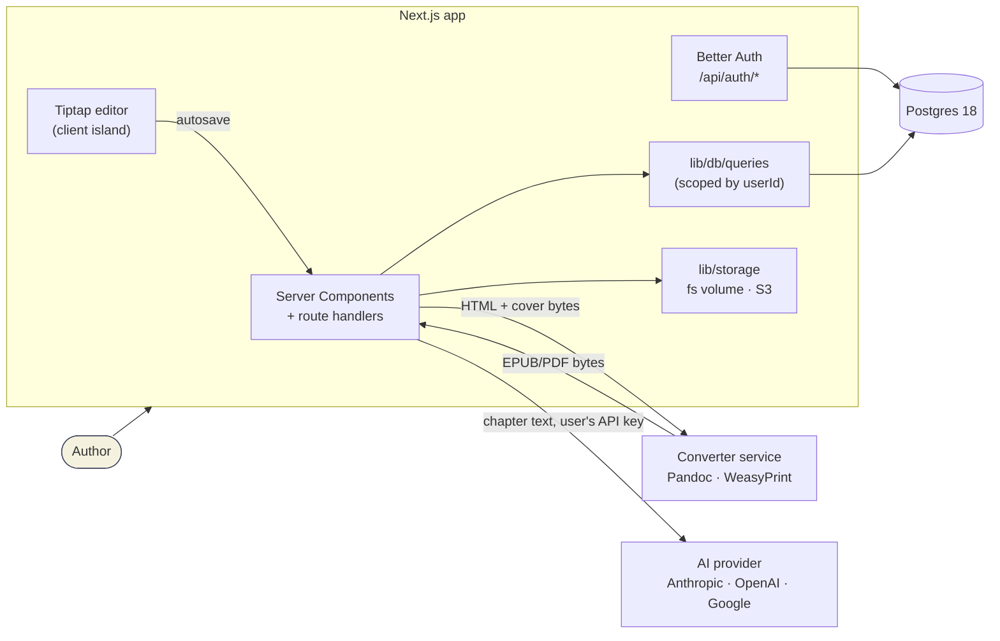

# Architecture

ManuHaven is a Next.js application, a Postgres database, and one sidecar
container that owns the document toolchain. Auth runs inside the app, and
files live on a volume or in an S3-compatible bucket. That is the whole system.



Three properties are worth stating up front, because most decisions follow
from them:

- **The browser never talks to the database or to storage.** Every read and
  write goes through a route handler, a server action or a Server Component,
  which calls a function in `lib/db/queries/`. Each of those takes `userId` and
  scopes by it. There is no row-level security behind it, so
  `tests/integration/db/authz.test.ts` checks, for every query function, that
  one user cannot read or change another's data.
- **Files are never public.** The database stores storage keys, not URLs, and
  browsers download through `/api/files/[...key]`, which checks project
  ownership first.
- **No deployment configuration is compiled into the build.** Browser-visible
  values are read at request time and injected into the document
  (`lib/public-env.ts`), so a published image runs anywhere.

## Tech Stack

| Layer | Technology | Version |
|---|---|---|
| Framework | Next.js (App Router) | 16.2.1 |
| UI Library | React | 19.2.4 |
| Language | TypeScript | 5.x |
| UI Components | shadcn/ui (Base UI, NOT Radix) + Tailwind CSS | v4 |
| Icons | lucide-react | 1.7.0 |
| Charts | recharts | 3.8.1 |
| Rich Text Editor | Tiptap | v3.22.1 — @tiptap/react, starter-kit, pm, extension-heading, extension-horizontal-rule, extension-placeholder |
| DOCX Parser | mammoth | ^1.12.0 |
| Database | PostgreSQL | 18 |
| ORM / migrations | Drizzle ORM + drizzle-kit (`lib/db/schema.ts`, `drizzle/`) | 0.45 |
| Auth | Better Auth (email/password, magic link, Google), Drizzle adapter | 1.7 |
| File Storage | `lib/storage/` — local filesystem or any S3-compatible bucket | — |
| Email | nodemailer over SMTP; Mailpit in development | — |
| Validation | zod | 4.x |
| Hosting | Self-hosted (Docker), or any Next.js host | — |
| EPUB/PDF Engine | Pandoc + WeasyPrint in a container (`services/converter`) | Verified: epubcheck 5.1 clean |
| AI Features | Vercel AI SDK 6 — Anthropic, OpenAI, or Google, keyed per user | `ai@6`, `@ai-sdk/*@3` |
| Package Manager | **bun** (never npm/npx/yarn — use bunx instead of npx) | — |

---

## Folder Structure

```
/
├── app/                          # Next.js App Router
│   ├── [locale]/                 # Every page lives under a locale segment
│   │   ├── layout.tsx            # Locale layout (fonts, i18n provider, runtime config)
│   │   ├── (marketing)/          # /, about, contact, privacy, terms
│   │   ├── (auth)/               # login, forgot-password, reset-password
│   │   └── (dashboard)/          # Authenticated app routes
│   │       ├── layout.tsx        # Dashboard layout (sidebar, topbar, footer)
│   │       └── dashboard/
│   │           ├── page.tsx      # Kanban board
│   │           ├── error.tsx
│   │           ├── loading.tsx
│   │           ├── library/  royalties/  reports/  profile/
│   │           ├── settings/     # page.tsx + ai/page.tsx
│   │           └── projects/
│   │               ├── actions.ts        # Server actions (create project, …)
│   │               └── [id]/{upload,edit,editorial,preview,royalties}/page.tsx
│   ├── api/
│   │   ├── health/route.ts
│   │   ├── auth/[...all]/route.ts       # Better Auth handler
│   │   ├── account/delete/route.ts
│   │   ├── files/[...key]/route.ts      # Authz-checked file downloads
│   │   ├── projects/[id]/manuscript/route.ts   # Multipart upload
│   │   ├── projects/[id]/cover/route.ts
│   │   ├── ai/
│   │   │   ├── metadata/route.ts
│   │   │   ├── editorial/route.ts       # SSE
│   │   │   ├── continuity/route.ts
│   │   │   └── assistant/
│   │   │       ├── chat/route.ts        # SSE
│   │   │       └── conversations/…
│   │   ├── convert/epub/route.ts
│   │   ├── convert/pdf/route.ts
│   │   ├── manuscripts/[projectId]/save/route.ts
│   │   ├── royalties/upload/route.ts
│   │   └── settings/ai/
│   │       ├── route.ts                 # PUT — save provider/model/key
│   │       └── test/route.ts            # POST — test connection
│   ├── global-error.tsx          # Last-resort error boundary
│   └── globals.css               # Tailwind v4 + theme vars (light + dark)
│
├── components/
│   ├── ai/                       # MetadataPanel, EditorialReport
│   ├── assistant/                # AssistantPanel (Chat + Codex tabs), CodexTab
│   ├── auth/
│   ├── dashboard/
│   ├── editor/
│   ├── marketing/                # Hero, Pillars, Faq, SiteNav/Footer, LanguageSwitcher
│   ├── preview/
│   ├── royalties/                # RoyaltyDashboard + revenue charts
│   ├── settings/                 # AiSettingsForm
│   ├── upload/
│   └── ui/                       # shadcn components
│
├── lib/
│   ├── db/
│   │   ├── client.ts             # getDb() — lazy pg pool + Drizzle
│   │   ├── schema.ts             # Every table, including Better Auth's
│   │   └── queries/              # The only code that touches the database
│   ├── auth/
│   │   ├── auth.ts               # Better Auth instance (getAuth())
│   │   ├── session.ts            # getSessionUser(), requireUser()
│   │   ├── features.ts           # Which sign-in methods are configured
│   │   ├── auth-client.ts        # Browser-side auth calls
│   │   └── emails.ts             # Magic link, reset, verification (en + es)
│   ├── email/mailer.ts           # SMTP; prints to the console in development
│   ├── storage/                  # getStorage(): fs or s3 driver, keys, upload sniffing
│   ├── export/                   # converter.ts (HTTP client), run-export.ts
│   ├── ai/                       # The single AI provider layer
│   │   ├── errors.ts             # Typed errors incl. NoAIKeyConfiguredError
│   │   ├── key-crypto.ts         # AES-256-GCM for user API keys
│   │   ├── preflight.ts          # Resolve up front; decide if cooldowns apply
│   │   ├── throttle.ts           # Per-user burst throttle for every AI route
│   │   ├── generate.ts           # generateForUser() — one-shot generation
│   │   ├── metadata.ts           # generateBookMetadata()
│   │   ├── editorial.ts          # Per-chapter map-reduce + synthesis + style
│   │   ├── continuity.ts         # generateStoryBible() — backs the Codex
│   │   ├── extract-text.ts       # tiptapToPlainText()
│   │   ├── validation.ts         # extractJSON(), validateWithSchema()
│   │   ├── prompts/              # metadata.ts, editorial.ts, continuity.ts
│   │   └── assistant/
│   │       ├── models.ts         # Registry + BYOK key resolution
│   │       ├── chat.ts           # streamText wrapper -> SSE frames
│   │       ├── tools.ts          # read_chapter, query_codex (mode-gated)
│   │       ├── context-builder.ts, modes.ts, title.ts, types.ts
│   ├── public-env.ts             # Runtime configuration, injected pre-hydration
│   ├── providers/royalties/      # CSV royalty sources
│   ├── manuscript/               # chapter-ops.ts, chapter-utils.ts, html-to-tiptap.ts, txt-to-tiptap.ts
│   ├── analytics/posthog.ts
│   ├── seo.ts                    # Also appOrigin(), the base URL auth uses
│   ├── utils.ts
│   ├── constants.ts
│   └── tiptap-to-html.ts
│
├── drizzle/                      # Generated SQL migrations (never edit a shipped one)
├── scripts/
│   ├── setup.sh                  # Writes .env with generated secrets
│   └── migrate.ts                # Applies drizzle/ under an advisory lock
├── services/converter/           # EPUB/PDF conversion service (Pandoc + WeasyPrint)
├── tests/                        # unit/, integration/ (real Postgres), fixtures/
├── docs/                         # self-hosting.md, ai.md, i18n.md, architecture.md
│   └── platform/                 # Deeper reference: schema, design system, EPUB
├── docker-compose.yml            # app + db + converter
├── compose.dev.yml               # Postgres, Mailpit (+ converter) for `bun run dev`
├── proxy.ts                      # Locale routing + session-cookie redirect
├── CLAUDE.md                     # Coding rules for AI agents
└── AGENTS.md                     # Pointer to CLAUDE.md
```

---

## Routes & Pages

| Route | Status | Data Sources |
|---|---|---|
| `/` | Built — landing page | — |
| `/login`, `/forgot-password`, `/reset-password` | Built | Better Auth |
| `/dashboard` | Built — Kanban board (4 cols) | projects + manuscripts |
| `/dashboard/library` | Placeholder — empty state only | — |
| `/dashboard/royalties` | Built — CSV upload + charts | royalties + projects |
| `/dashboard/reports` | Placeholder | — |
| `/dashboard/profile` | Built | profiles |
| `/dashboard/settings` | Built — hub + AI subpage | profiles + user_ai_settings |
| `/dashboard/settings/ai` | Built — BYOK provider/model/key | user_ai_settings |
| `/dashboard/projects/[id]/upload` | Built — DOCX/TXT upload | projects + manuscripts |
| `/dashboard/projects/[id]/edit` | Built — Tiptap editor + chapter nav | projects + manuscripts |
| `/dashboard/projects/[id]/preview` | Built — template selector + export | projects + manuscripts + templates |
| `/dashboard/projects/[id]/editorial` | Built — editorial report (SSE) | projects + manuscripts |
| `/dashboard/projects/[id]/royalties` | Built — per-project revenue charts | royalties |

---

## Data, auth and storage

| Piece | Entry point | Rule |
|---|---|---|
| Database | `lib/db/queries/*` | The only importers of `getDb()` and `drizzle-orm`. Every function takes `userId`; project-owned rows are scoped through `ownedProjectIds(userId)` |
| Session | `getSessionUser()` in routes and server actions, `requireUser()` in pages | `proxy.ts` only redirects on a missing cookie; the real check is in the handler |
| Auth | `getAuth()` (`lib/auth/auth.ts`), mounted at `/api/auth/*` | A database hook creates the `profiles` row for every new user |
| Storage | `getStorage()` (`lib/storage/`) | Keys start `{userId}/{projectId}/`; `fileUrl(key)` gives the `/api/files` link |

The only unauthenticated routes are `/api/health` and `/api/auth/*`.

---

## Conversion Pipeline

```
1. Author uploads .docx OR writes in Tiptap
2. .docx → mammoth → HTML → html-to-tiptap.ts → Tiptap JSON
   OR Tiptap editor saves JSON directly
3. Tiptap JSON → tiptap-to-html.ts → clean semantic HTML
4. HTML + template name + cover bytes + metadata → POST to the converter service
   (lib/export/run-export.ts, shared by app/api/convert/{epub,pdf})
5. Converter: Pandoc → EPUB 3, or WeasyPrint → PDF → returns the file bytes
6. App stores the file (lib/storage, key {userId}/{projectId}/exports/{id}.{ext})
   and records it in `exports`
7. Frontend shows the preview and a download link via /api/files

The converter is stateless and holds no credentials beyond its own API key:
it fetches nothing and writes nothing outside a scratch directory.
```

### Template CSS Architecture
- Each template is a single CSS file styling semantic HTML
- Targets: `h1`, `h2`, `p`, `blockquote`, `.chapter-title`, `.scene-break`, `.drop-cap`
- NO JavaScript in templates (EPUB readers don't support it)
- Must support both light and dark reading modes
- Validated against DAISY ACE before shipping

---

## Deployment

Both parts ship as images, published to GHCR on every release:

| Image | Contents | Notes |
|---|---|---|
| `manuhaven` | The Next.js app, `output: "standalone"`, node:24-slim, non-root; runs migrations, then the server | Healthcheck on `/api/health` |
| `manuhaven-converter` | Pandoc, WeasyPrint, the Express service, non-root | Healthcheck on `/health`; never expose publicly |

`docker compose up` runs both, plus `postgres:18-alpine`. The app also runs on
any Node host with a reachable Postgres (use `STORAGE_DRIVER=s3` where the
filesystem is ephemeral); the converter cannot, since it needs system binaries.

Schema changes start in `lib/db/schema.ts`; `bun run db:generate` writes the
migration into `drizzle/`, and the app image applies pending migrations on
start (`bun run db:migrate` in development). Never edit a production schema
by hand — and never edit a migration that has shipped; add another.

See `docs/self-hosting.md` for the full deployment guide.

---

## Performance Targets

- Dashboard page load: < 1.5s (server-rendered)
- Tiptap editor: smooth typing at 80K+ words (chapter-based lazy loading)
- EPUB conversion: < 30s for a full novel
- PDF conversion: < 60s for a full novel
- Lighthouse score: > 90 (performance, accessibility)
